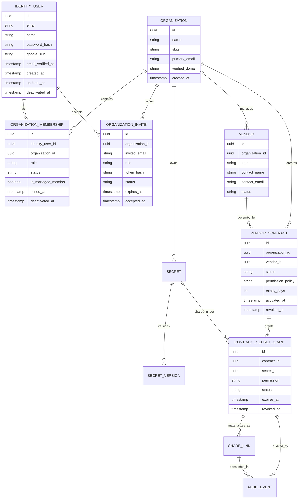
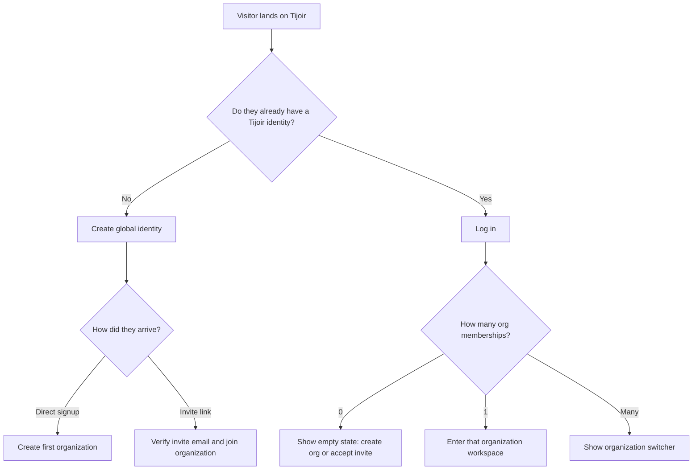
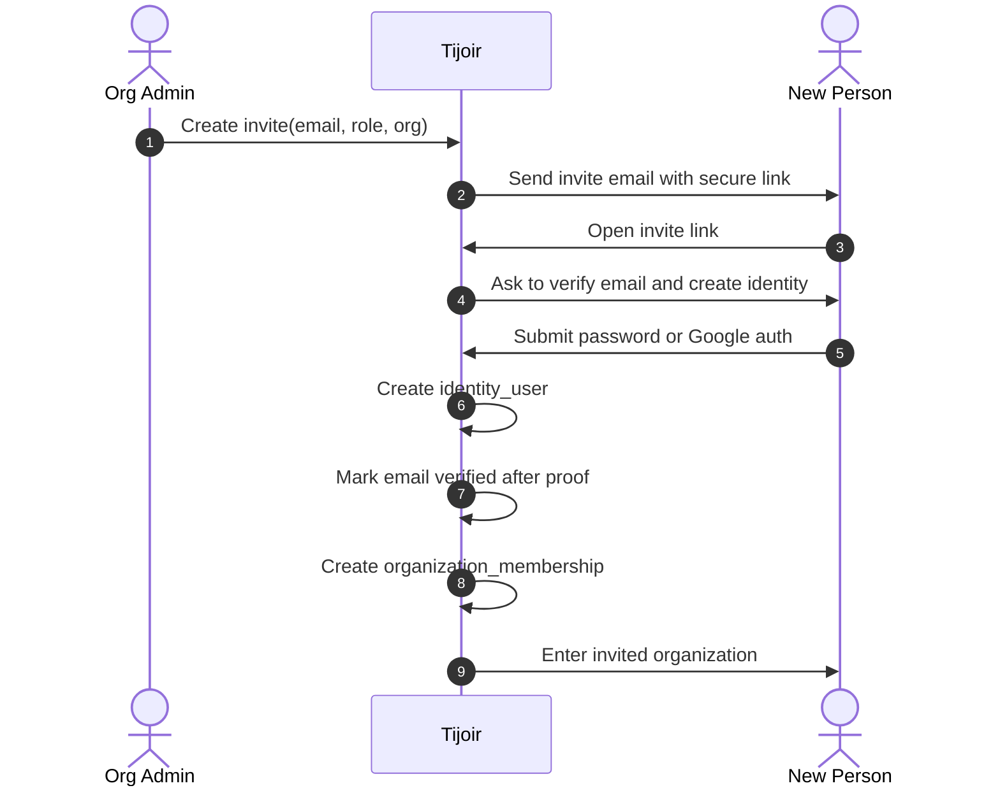
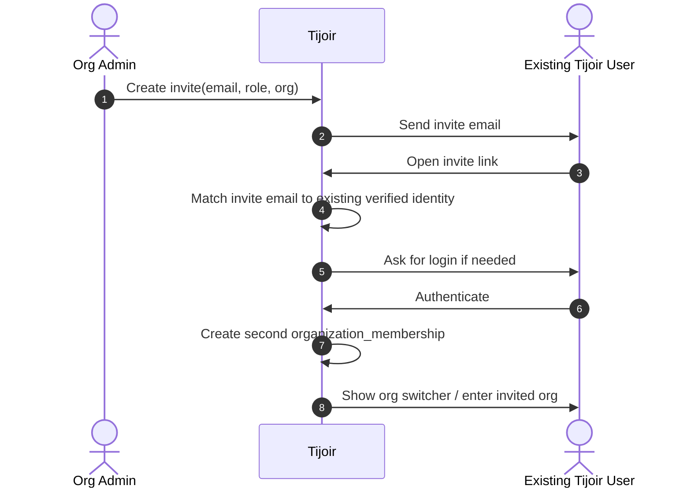
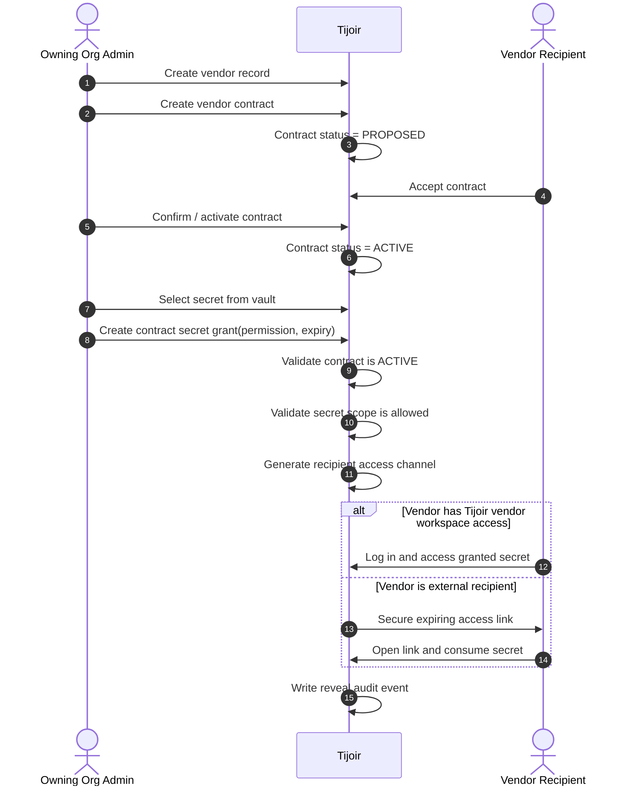
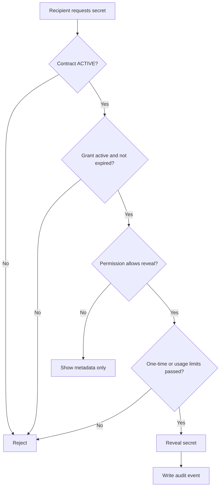
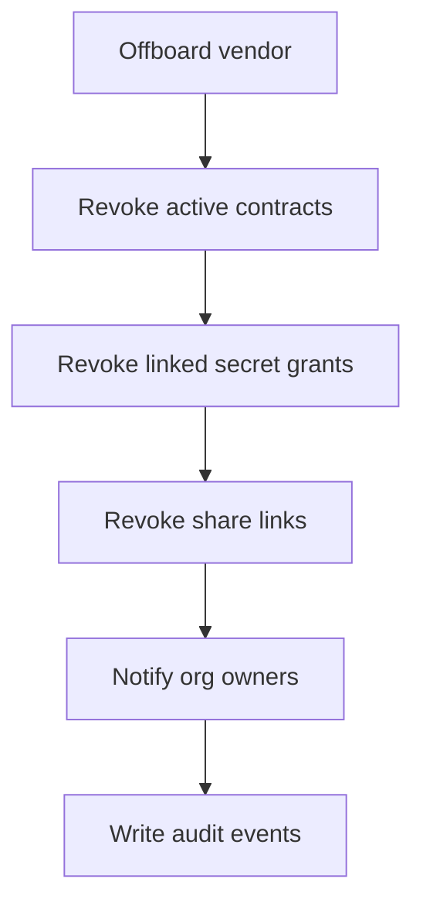

# Tijoir - Global Identity, Organization Membership, and Vendor Secret Sharing

_Date: 2026-07-15_

## Purpose

This document defines the recommended next-step architecture for Tijoir after the current MVP.

It covers two tightly related areas:

1. a proper SaaS identity and organization-membership model
2. a contract-bound vendor secret-sharing model

This document is based on:

- current Tijoir product and backend/frontend flow gaps
- comparison against common SaaS patterns used by GitHub, Atlassian, and Slack
- the desired Tijoir position as a secure B2B secret-sharing SaaS, not just a single-tenant vault app

## Status

This is a **target architecture** document, not a claim that the current implementation already behaves this way.

Current Tijoir MVP still behaves closer to:

- one email -> one user record
- one user -> one org
- invite acceptance creates a new org-local user

The design below is the recommended direction for the next auth and collaboration phase.

---

## 1. Why this change is needed

The current MVP has these structural limitations:

- a single email cannot join more than one organization
- every non-invited new user must create a fresh organization
- invite acceptance is too tightly coupled to org-local account creation
- vendor collaboration and internal membership can become conceptually mixed
- email verification and invite trust are not modeled strongly enough for a long-term SaaS product

For a proper B2B SaaS, identity must be separated from organization membership.

That is how mature products generally work.

---

## 2. What mature SaaS products do

## 2.1 GitHub pattern

GitHub uses a personal account as the base identity and then invites that account into organizations.

Important patterns:

- one user account can belong to multiple organizations
- organization membership is separate from the user identity
- invitation acceptance is tied to a verified email on the user's account
- organizations can verify domains for trust and control

What Tijoir should take from this:

- global identity first
- membership second
- email ownership matters before org access is granted

## 2.2 Atlassian pattern

Atlassian has the clearest identity model for this use case.

Important patterns:

- one Atlassian account can access multiple organizations and apps
- account is global
- org access is granted separately
- users can be either `managed accounts` or `external users`
- someone can be managed in one org and external in another
- verified domains are used for stronger administrative control

What Tijoir should take from this:

- separate `identity` from `organization membership`
- classify people by relationship to the org, not just by email existence
- support both managed internal users and external collaborators

## 2.3 Slack pattern

Slack uses workspaces for internal membership and Slack Connect for external collaboration.

Important patterns:

- internal workspace membership is not the same as external collaboration
- outside organizations can collaborate without becoming full internal members
- external communication is explicit, bounded, and controlled

What Tijoir should take from this:

- vendor collaboration should not mean full org membership by default
- external sharing should be contract-bound and narrow in scope

---

## 3. Product principles for Tijoir

The following principles should drive the next design:

1. **One human identity can belong to many organizations**
2. **Organization membership is a relationship, not the user itself**
3. **Internal employee access and external vendor access are different models**
4. **Vendor access must always be narrower than org-internal access**
5. **A secret must never be shared without an explicit policy boundary**
6. **Every reveal must remain auditable**
7. **Domain ownership should improve trust, but should not block legitimate external collaboration**

---

## 4. Recommended domain model

## 4.1 High-level separation

Tijoir should separate:

- **Identity**: who the person is globally
- **Membership**: what org they belong to and in what role
- **Collaboration**: what external access they have
- **Contracts**: why a vendor can access a secret

## 4.2 Core entities

## 4.3 Identity user

`identity_user` is the global login identity.

Rules:

- `email` is globally unique
- email verification belongs here
- Google linking belongs here
- password belongs here
- this record must not store `org_id`

## 4.4 Organization membership

`organization_membership` is the bridge that says:

- this identity belongs to this organization
- with this role
- in this current status

Recommended membership roles:

- `ORG_OWNER`
- `ADMIN`
- `MEMBER`
- `VIEWER`
- `AUDITOR`

Recommended membership statuses:

- `ACTIVE`
- `INVITED`
- `SUSPENDED`
- `REMOVED`

## 4.5 Managed member vs external collaborator

Borrowing from Atlassian's model, Tijoir should distinguish:

- **Managed member**
  - internal employee
  - typically company-domain identity
  - stronger org controls may apply later

- **External collaborator**
  - contractor or outside partner
  - may still have limited org-level access
  - not treated as a full internal workforce identity

This distinction matters even if both are technically represented by memberships.

---

## 5. Recommended auth and onboarding flows

## 5.1 Base identity flow

## 5.2 Direct signup

Direct signup should do this:

1. create global identity
2. verify email
3. create first organization
4. create `ORG_OWNER` membership

This preserves the simple onboarding that already feels good, while removing the one-user-one-org trap.

## 5.3 Invite acceptance for a new person

## 5.4 Invite acceptance for an existing user

This is the critical missing SaaS behavior today.

### Key rule

Accepting an invite should create a **membership**, not a brand-new org-local user.

## 5.5 Email verification rule

Recommended rule set:

- direct signup: verification required
- invite acceptance: verification required unless the identity already has a verified matching email
- Google login: acceptable as verified identity if token validation succeeds

This is stronger than the current MVP and much more coherent.

---

## 6. Organization switching

Once one identity can join multiple organizations, frontend and backend need explicit workspace selection.

## 6.1 UX model

- if membership count = 1 -> auto-enter org
- if membership count > 1 -> show org switcher
- allow switching from sidebar top section

## 6.2 Session model

Recommended split:

- **access token**
  - global identity subject
  - active organization context
- **refresh token**
  - tied to identity
  - can mint access tokens for a selected org membership

## 6.3 Access checks

Every protected request should resolve:

1. identity user
2. active organization
3. active membership
4. role within that membership

---

## 7. Vendor collaboration model for Tijoir

This is the second major part of the design.

The right model is:

**Vault Secret -> Vendor Contract -> Secret Grant -> Recipient Access**

Not:

**Vault Secret -> random ungoverned link**

## 7.1 Why vendor sharing must be contract-bound

Tijoir is not a generic notes app or a public pastebin.

If a business shares:

- SFTP credentials
- SSH keys
- API tokens
- webhook secrets

that access must be bound to:

- a specific vendor
- a specific relationship
- a specific permission
- a specific time window

That means the contract is the policy boundary.

---

## 8. Recommended vendor-sharing lifecycle

## 8.1 High-level flow

## 8.2 Detailed sequence

---

## 9. Vendor access models

Tijoir should support two distinct vendor access models.

## 9.1 Model A - external secure link

Use this when:

- vendor does not need a full Tijoir account
- access is narrow and time-bound
- secret sharing is transactional

Properties:

- contract-bound
- secret-specific
- expiring
- revocable
- one-time or limited reveal

Best for:

- SFTP password handoff
- webhook setup
- short-lived onboarding tasks

## 9.2 Model B - vendor workspace access

Use this when:

- vendor is also onboarded as an org in Tijoir
- collaboration is ongoing
- recurring access under contract is needed

Properties:

- vendor logs into their own org context
- can see only grants shared under active contracts
- no raw access to owner org vault

Best for:

- recurring managed integrations
- long-running vendor partnerships
- multiple active secret grants under one contract

## 9.3 Recommendation

Tijoir should support both.

That gives:

- easy external sharing for simple use cases
- clean SaaS-grade workspace access for mature customers

---

## 10. Permission model for contract-bound secret access

Recommended permissions:

- `VIEW_ONCE`
  - recipient can reveal exactly once
  - strongest default for initial handoff

- `VIEW_UNTIL_REVOKED`
  - recipient can continue to reveal while contract grant is active
  - useful for operational credentials

- `ROTATION_NOTIFY_ONLY`
  - recipient is notified that the secret rotated
  - raw reveal is not allowed through this grant

Optional future additions:

- `METADATA_ONLY`
- `DOWNLOAD_ONCE`
- `REVEAL_WITH_JUSTIFICATION`

## Access decision logic

---

## 11. Offboarding and revocation

Vendor offboarding must be explicit and automatic.

## 11.1 Offboarding flow

## 11.2 Rules

When a vendor is offboarded:

- active contracts become revoked
- all linked share links are revoked
- future reveal is blocked
- old grants are not silently left alive

This must be one backend operation, not a manual checklist.

---

## 12. Current-state to target-state migration

Tijoir should move in phases.

## Phase 1 - keep current MVP running

- preserve current auth flow
- preserve current org-local behavior
- improve email delivery and verification quality

## Phase 2 - introduce global identity

- add `identity_user`
- add `organization_membership`
- migrate current `users` rows into identity + membership rows
- keep old auth endpoints but change internals

## Phase 3 - support multi-org membership

- allow existing users to accept invites into additional orgs
- add org switcher
- add active-org context to access tokens

## Phase 4 - complete vendor contract-bound sharing

- make contract the primary sharing boundary
- support both external links and vendor workspace access
- finish revoke/offboard automation

---

## 13. Recommended API direction

This is not the final contract, but the shape should move toward this.

## Identity and membership

- `POST /api/auth/register`
  - create identity + first org + owner membership

- `POST /api/auth/login`
- `POST /api/auth/google/exchange`
- `POST /api/auth/refresh`
- `GET /api/auth/me`

- `GET /api/me/organizations`
  - list memberships

- `POST /api/me/organizations/switch`
  - switch active workspace

- `POST /api/organization/invites`
- `POST /api/organization/invites/accept`
  - add membership to existing identity if possible

## Vendor sharing

- `POST /api/vendors`
- `POST /api/vendors/{vendorId}/contracts`
- `POST /api/vendors/contracts/{contractId}/accept`
- `POST /api/vendors/contracts/{contractId}/activate`
- `POST /api/vendors/contracts/{contractId}/grants`
- `POST /api/vendors/contracts/{contractId}/grants/{grantId}/share-links`
- `POST /api/vendors/{vendorId}/offboard`

## Public / recipient access

- `GET /api/public/share-links/{token}`
- `POST /api/public/share-links/{token}/consume`

---

## 14. Recommended UI implications

## 14.1 Auth and onboarding

- landing page remains simple
- direct signup still creates an org
- invite flow becomes a real first-class path
- login is identity-based, not org-user-based

## 14.2 Organization switcher

- top-left org switcher in authenticated app shell
- user can belong to multiple orgs
- last active org can be remembered safely

## 14.3 Vendor workflow

Vendor section should read clearly as:

1. vendor profile
2. contracts
3. contract secret grants
4. share activity
5. offboarding

The UI should not present vendor sharing as just “create a random link.”

---

## 15. Recommendation summary

The best architecture for Tijoir is:

1. **global user identity**
2. **separate organization membership**
3. **verified-email-based invite acceptance**
4. **managed vs external collaborator distinction**
5. **contract-bound vendor secret sharing**
6. **support for both external links and vendor workspace access**

This gives Tijoir a model that is:

- more like GitHub and Atlassian for identity
- more like Slack Connect for external collaboration boundaries
- better aligned with secure enterprise secret sharing

---

## 16. Implementation recommendation

If only one major backend redesign is taken next, it should be this one:

**split current org-local user model into global identity + org membership.**

That unlocks:

- multi-org membership
- cleaner invites
- better enterprise auth
- vendor collaboration without membership confusion
- safer long-term product evolution

Without this change, many later features will keep feeling bolted on.

---

## 17. Source notes

This design was informed by the following official documentation and product pages:

- GitHub Docs - Inviting users to join your organization  
  https://docs.github.com/en/organizations/managing-membership-in-your-organization/inviting-users-to-join-your-organization

- GitHub Docs - Verifying or approving a domain for your organization  
  https://docs.github.com/en/organizations/managing-organization-settings/verifying-or-approving-a-domain-for-your-organization

- Atlassian Support - Make Atlassian's global account model work for you  
  https://support.atlassian.com/user-management/docs/make-atlassians-global-account-model-work-for-you/

- Atlassian Support - What are managed accounts?  
  https://support.atlassian.com/user-management/docs/what-are-managed-accounts/

- Atlassian Support - Invite a user  
  https://support.atlassian.com/user-management/docs/invite-a-user/

- Atlassian Support - Give users access to apps  
  https://support.atlassian.com/user-management/docs/give-users-access-to-products/

- Slack Help - Invite new members to your workspace  
  https://slack.com/help/articles/201330256-Invite-new-members-to-your-workspace

- Slack Connect  
  https://slack.com/connect

