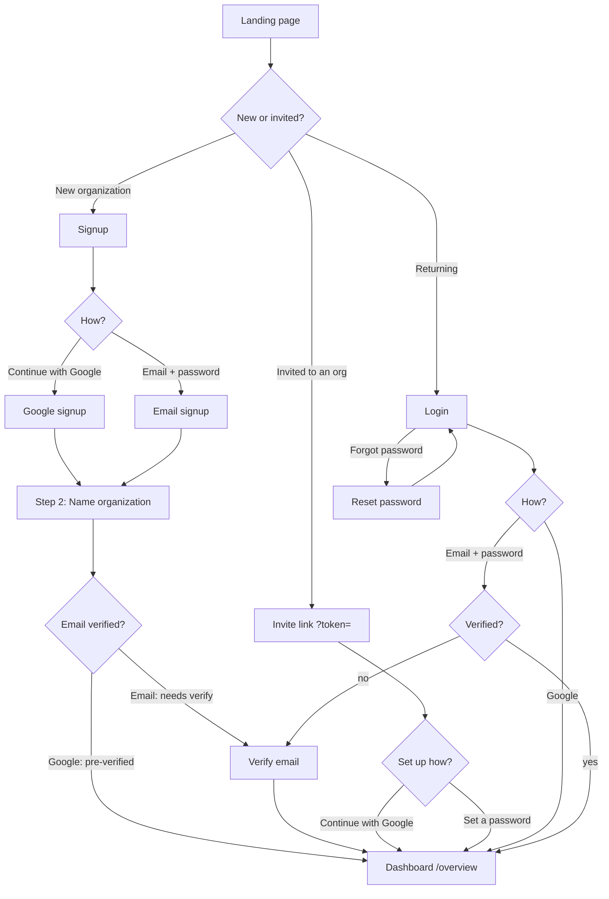
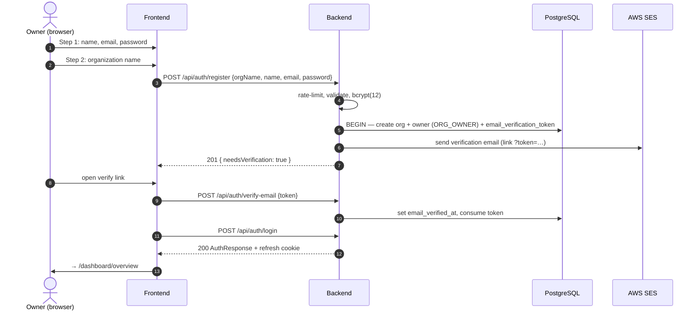
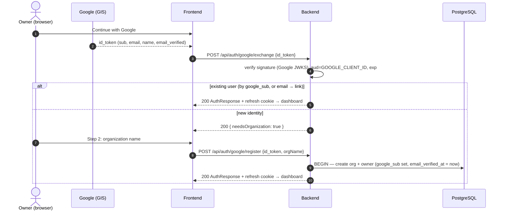
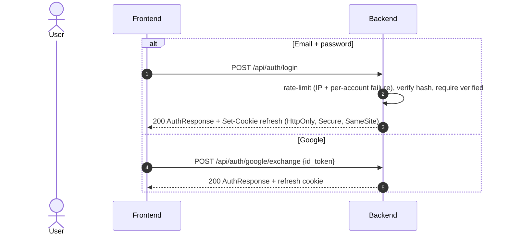
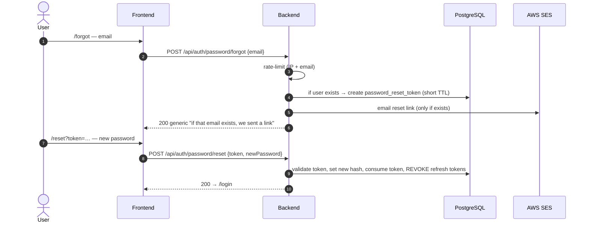
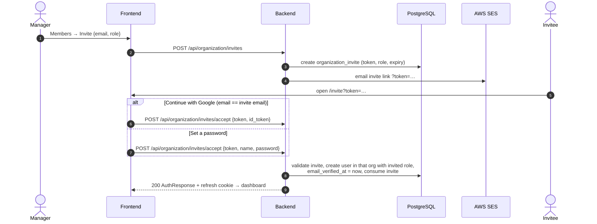
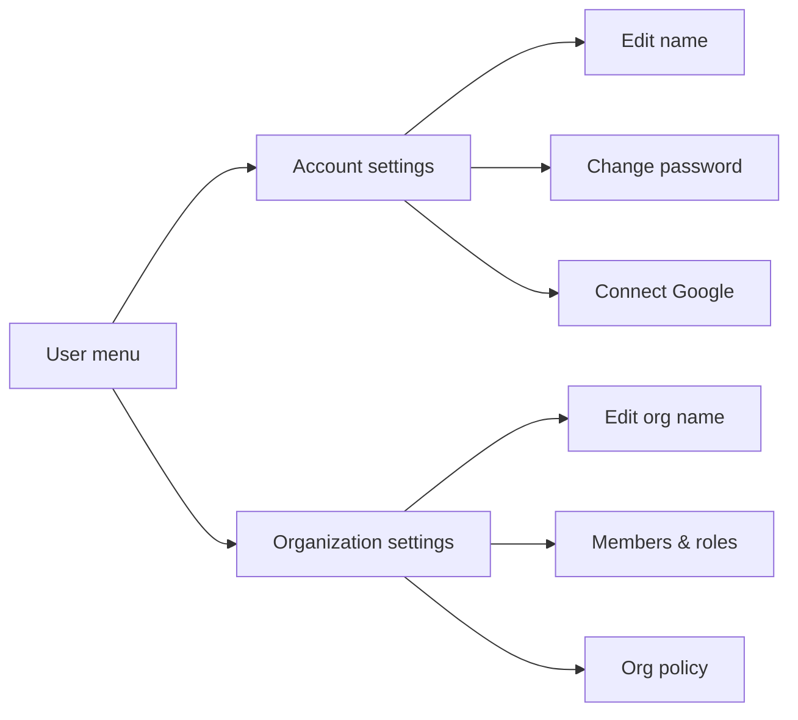

# Tijoir — Authentication & Onboarding: Work Scope

_Date: 2026-07-15. The agreed scope for the auth + onboarding work. Flows, data model, endpoints, and the account/profile settings pages._

## Decisions (final)
- **Auth:** email/password **+ Google sign-in (self-built)**.
- **Identity:** **one org per user** (keep `users.org_id`; email globally unique).
- **Signup:** **two-step UI** (create account → name organization); backend write stays atomic.
- **Email delivery:** **AWS SES** (existing `SesEmailSender`) — powers verification, password reset, invites.
- **Account & Org settings pages:** **in scope, minimal but proper.**
- **Password reset:** in scope (new).
- **Invites:** email link-based.

### Explicitly OUT of scope (not now)
SSO / SAML / SCIM · MFA · multi-org membership & org switching · first-run checklist · magic-link login · billing.

_Rationale for no self-built SAML/SCIM: XML-signature verification is a critical-CVE minefield and per-tenant IdP config is weeks of work. If enterprise SSO becomes a goal, adopt a provider (WorkOS/Auth0/Clerk) rather than hand-rolling — structure new auth code behind a clean boundary so that swap stays additive._

## Roles
`ORG_OWNER` (first user) · `ADMIN` · `MEMBER` · `VIEWER` · `AUDITOR`. Assigned at invite time; enforced server-side on every mutation.

---

## 1. Entry points → workspace

---

## 2. New organization — email + password (two UI steps, atomic backend)

- Atomic org+owner creation (no orphan users). Organization-email field dropped (defaults to owner email). Login gated on `email_verified_at`.

---

## 3. New organization — Google (GIS id_token, backend-verified)

- Google users are email-pre-verified. Account linking by email (email unique). `id_token` re-verified on register — never trust a client flag.

---

## 4. Login

Session: 15-min access JWT (memory) + rotating one-time refresh token (HttpOnly cookie, hashed at rest). Silent `/refresh` on 401.

---

## 5. Password reset (new)

- No account enumeration (generic response). Reset revokes existing sessions.

---

## 6. Invite → member onboarding

- Accepting an invite proves the email (no separate verify). If the invitee's email already belongs to another org, accept is rejected with a clear message (one-org-per-user).

---

## 7. Account & Organization settings (minimal but proper)

A dedicated settings surface, reached from the sidebar user menu.

### Account (personal)
- View: name, email, role, sign-in methods (password set? Google connected?).
- **Edit name.**
- **Change password** (current + new) — for logged-in users; distinct from the reset flow. Google-only users see "Set a password" instead.
- **Connect Google** — link a Google account to the current user (if not already linked). Unlink deferred unless a password exists.

### Organization (managers only)
- **Edit organization name.**
- Link to Members (invite / change role / deactivate) — existing.
- Org policy (share-link expiry defaults, etc.) — existing `GET/PUT /policy`.

---

## 8. Data model — forward migration `V12`

| Change | Table | Why |
|--------|-------|-----|
| add `google_sub VARCHAR(255)` unique, nullable | `users` | link a Google identity |
| make `password_hash` **nullable** | `users` | Google-only users have no password |
| new `password_reset_tokens` (id, user_id, token_hash, expires_at, consumed_at, created_at) | — | reset flow |

Additive only; never edit shipped `V1`–`V11`.

## 9. Endpoint map (new / changed)

| Method | Path | Purpose |
|--------|------|---------|
| POST | `/api/auth/register` | email signup (org + owner, atomic); org-email dropped |
| POST | `/api/auth/google/exchange` | verify Google id_token → login or `needsOrganization` |
| POST | `/api/auth/google/register` | new Google user → create org + owner |
| POST | `/api/auth/password/forgot` | request reset link (generic response) |
| POST | `/api/auth/password/reset` | set new password via token, revoke sessions |
| POST | `/api/auth/password/change` | logged-in user changes password (current + new) |
| PATCH | `/api/auth/me` | update own display name |
| POST | `/api/auth/google/link` | link Google to the current user |
| PUT | `/api/organization` | update organization name (managers) |
| POST | `/api/organization/invites/accept` | accept via password **or** Google id_token |

Unchanged: `/login`, `/refresh`, `/logout`, `/verify-email`, `/resend-verification`, `/me`, members + policy endpoints.

## 10. Config
- `GOOGLE_CLIENT_ID` (backend verify) + `NEXT_PUBLIC_GOOGLE_CLIENT_ID` (frontend GIS).
- SES: verified sender identity + production access.

## 11. Frontend surfaces
- **Signup:** two-step wizard + "Continue with Google" (GIS).
- **Login:** "Continue with Google" + "Forgot password" link.
- **New pages:** `/forgot`, `/reset`.
- **Invite accept:** password OR Google.
- **Settings:** Account tab (name, change password, connect Google) + Organization tab (name, members, policy).

## Open dependency
**AWS SES production access + a verified sender** is required for verification / reset / invite emails to deliver. In SES sandbox, only verified recipient addresses receive mail (dev can use the in-app dev-token shortcut).
