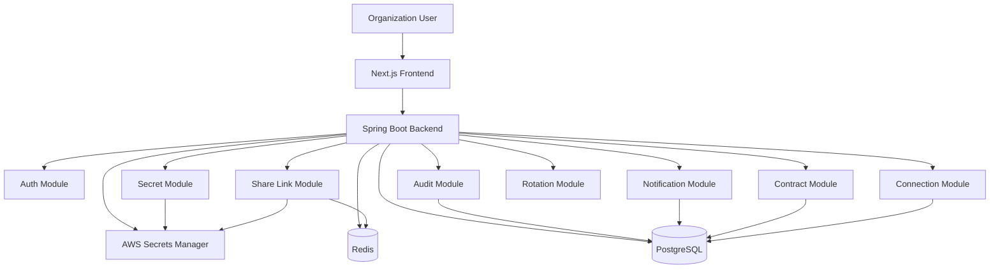
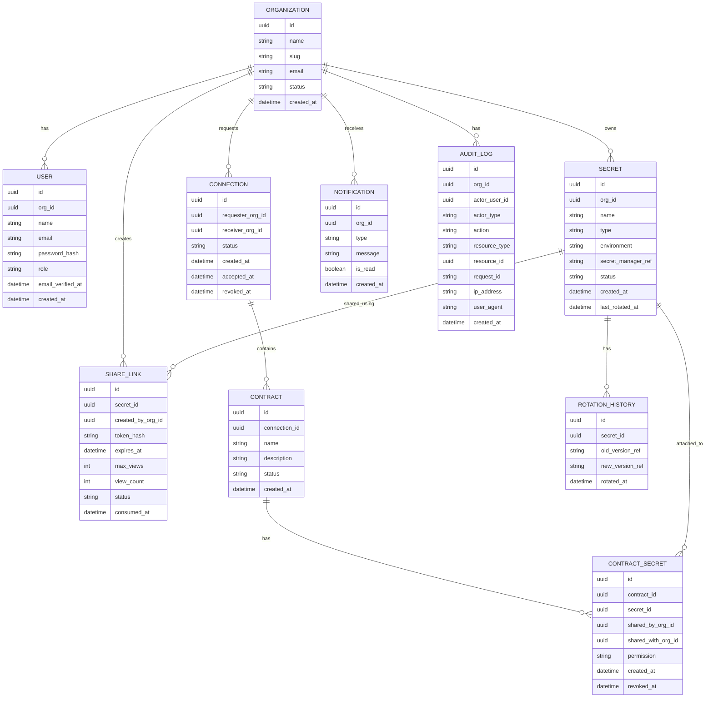
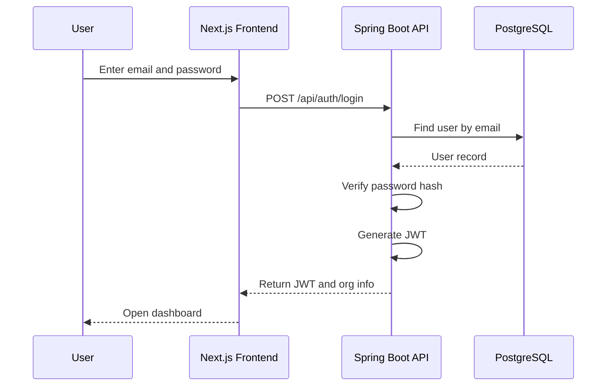
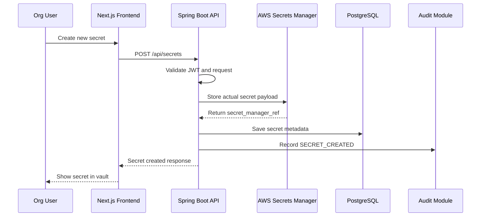
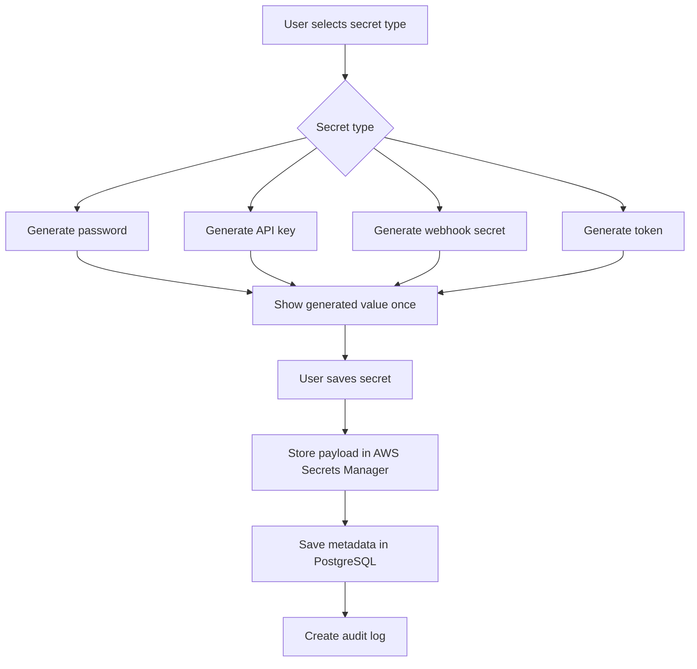
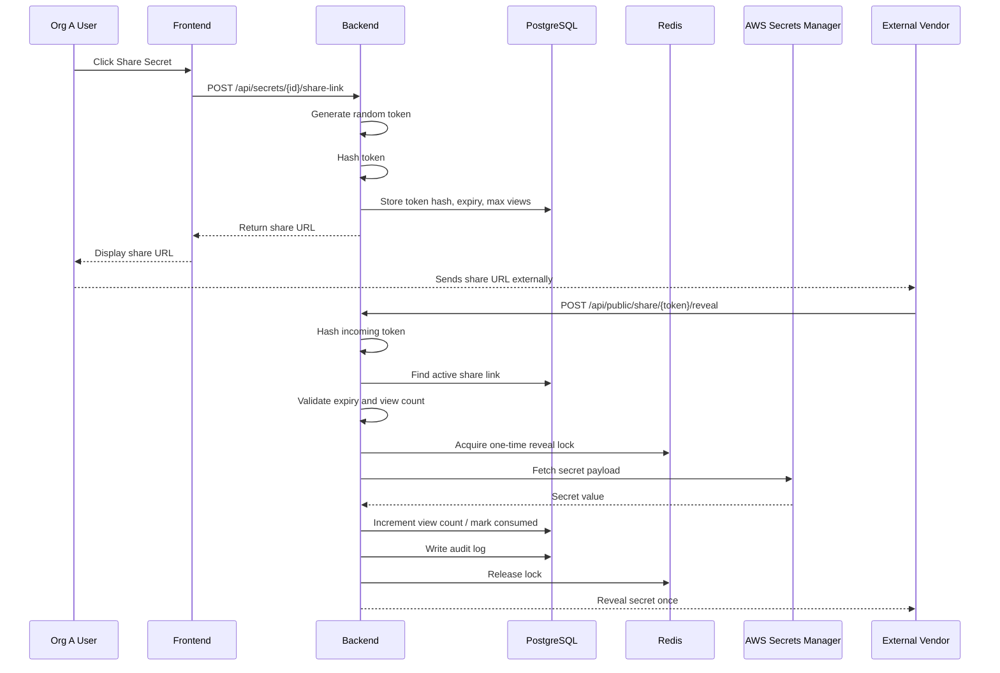
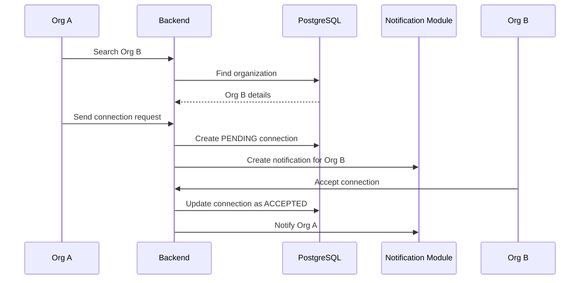
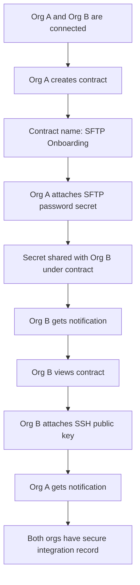
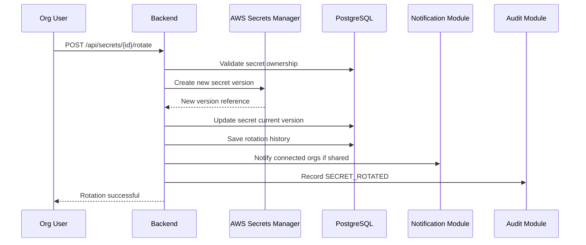
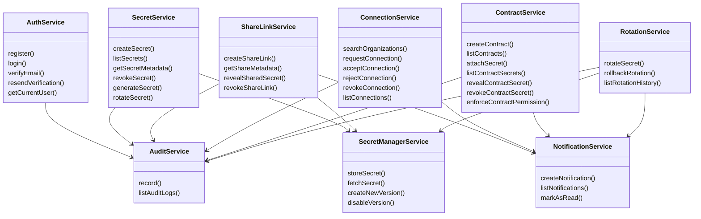

# Tijoir — Secure Secret Vault & Organization-to-Organization Credential Exchange

## 1. Project Overview

**Tijoir** is a secure backend platform that allows organizations to create, store, share, receive, and rotate sensitive credentials such as passwords, API keys, SSH keys, SFTP credentials, webhook secrets, and access tokens.

The platform solves the common problem where companies exchange sensitive credentials with external vendors through emails, chats, documents, or ticket comments. Tijoir replaces this risky flow with a secure vault, encrypted secret storage, one-time share links, trusted organization-to-organization connections, integration contracts, audit logs, and secret rotation history.

---

## 2. Problem Statement

Modern companies frequently work with external vendors and integration partners such as Salesforce, Sprinklr, payment providers, analytics vendors, SFTP partners, and support teams.

During onboarding or integration setup, organizations often need to exchange sensitive credentials such as:

* SFTP usernames and passwords
* SSH public/private keys
* API keys
* OAuth client secrets
* webhook signing secrets
* certificates
* access tokens
* service credentials

In many teams, this exchange still happens through:

* email threads
* Slack/Teams messages
* Google Docs
* spreadsheets
* ticket comments
* password-protected ZIP files
* screenshots

This creates major security and operational risks:

* secrets remain permanently in emails and chats
* credentials may be forwarded accidentally
* no proper expiry or revocation
* no audit trail of who viewed the secret
* difficult vendor offboarding
* difficult secret rotation
* no mapping between vendors and secrets
* no centralized credential lifecycle tracking

---

## 3. Proposed Solution

Tijoir provides a secure credential exchange platform where each organization gets a dashboard to manage its secrets and vendor connections.

The platform supports three main capabilities:

### 3.1 Secure Secret Vault

Organizations can create, generate, and store secrets securely.

Supported secret types:

* password
* API key
* webhook secret
* SSH public key
* SSH private key
* SFTP password
* token
* certificate
* custom secret

The actual secret value is stored securely in **AWS Secrets Manager** or encrypted storage. The application database stores only metadata, ownership, policy, status, and access records.

---

### 3.2 Secure Sharing

Organizations can share secrets in two ways:

#### Method 1: Secure Public Share Link

Used when the receiver is not onboarded to Tijoir.

Example:

```text
Org A creates an SFTP password.
Org A generates a secure one-time share link.
Vendor opens the link and views the secret once.
The link expires or becomes consumed.
```

Features:

* one-time view
* expiry time
* max view count
* token hashing
* optional passphrase
* Redis-based access lock
* audit logging

---

#### Method 2: Organization-to-Organization Exchange

Used when both sender and receiver are onboarded to Tijoir.

Example:

```text
Org A connects with Vendor B.
Org A creates an integration contract.
Org A shares SFTP credentials inside the contract.
Vendor B shares its SSH public key inside the same contract.
Both sides have a secure shared integration record.
```

Features:

* organization connection request
* accept/reject workflow
* integration contract
* contract-based secret sharing
* contract-level secret permissions
* vendor offboarding and access revocation
* notifications
* audit logging

---

### 3.3 Secret Rotation

Organizations can rotate old credentials and replace them with new versions.

Example:

```text
Old API key is compromised or expired.
Org rotates the secret.
New version becomes active.
Old version becomes inactive.
Connected vendor receives notification.
Audit log records the rotation.
```

---

### 3.4 Vendor Offboarding

Organizations can revoke a vendor connection and remove access to shared contract secrets.

Example:

```text
Vendor contract ends.
Org owner revokes the connection.
All active contract secret access for that vendor is revoked.
Vendor receives notification.
Audit log records who performed the offboarding action.
```

---

## 4. MVP Scope

The MVP focuses on backend correctness, secure workflows, and clean architecture.

The project should be positioned as a **vendor credential exchange platform**, not as a generic replacement for HashiCorp Vault, 1Password, Infisical, or AWS Secrets Manager. The strongest use case is secure organization-to-organization credential exchange during vendor onboarding, integration setup, SFTP onboarding, webhook setup, and partner offboarding.

### In Scope

* organization registration and login
* JWT-based authentication
* email verification before sensitive actions
* role-based access control
* secure secret creation
* secret generator
* AWS Secrets Manager integration
* PostgreSQL metadata storage
* Redis rate limiting and one-time link locking
* secure share links
* organization-to-organization connections
* integration contracts
* contract-based secret sharing
* contract secret permissions
* vendor offboarding workflow
* append-only audit logs
* basic secret rotation with version history
* focused backend tests
* README demo script for local review

### MVP Roles

```text
ORG_OWNER  - full organization control, user management, billing-ready owner
ADMIN      - manages secrets, connections, contracts, and rotation
MEMBER     - creates and shares secrets allowed by policy
VIEWER     - reads metadata and permitted shared secrets only
AUDITOR    - reads audit logs and metadata, cannot reveal secret payloads
```

### Out of Scope for MVP

* Kafka
* microservices
* payment/billing
* enterprise SSO
* SAML/SCIM
* mandatory MFA
* complex approval workflows
* legal contract signing
* full zero-knowledge encryption
* mobile app
* Slack/Teams integration
* real-time WebSocket notifications
* email delivery system beyond verification-token stubs
* advanced anomaly detection
* full frontend polish

---

## 5. Tech Stack

### Frontend

```text
Next.js
TypeScript
Tailwind CSS
shadcn/ui
```

### Backend

```text
Java 21
Spring Boot
Spring Security
Spring Data JPA
Bean Validation
Flyway
```

### Database

```text
PostgreSQL
```

### Cache / Security Control

```text
Redis
```

Used for:

* rate limiting
* failed attempt counters
* one-time share link locking
* temporary verification state

### Secret Storage

```text
AWS Secrets Manager
```

Used for storing actual secret payloads.

### DevOps

```text
Docker
Docker Compose
GitHub Actions
OpenAPI/Swagger
```

---

## 6. High-Level Architecture



---

## 7. System Responsibilities

### 7.1 Frontend

Responsible for:

* organization login/register UI
* dashboard
* secret creation page
* secret list page
* share link generation UI
* vendor connection UI
* integration contract UI
* notification view
* audit log view
* public share link page

---

### 7.2 Backend

Responsible for:

* authentication and authorization
* validating all requests
* managing organization data
* managing secret metadata
* storing/retrieving secret payloads from AWS Secrets Manager
* generating secure share links
* enforcing expiry and one-time view policies
* managing org-to-org connections
* managing integration contracts
* creating notifications
* writing audit logs
* handling secret rotation

---

### 7.3 PostgreSQL

Stores non-secret metadata:

* organizations
* users
* secret metadata
* share links
* connections
* contracts
* notifications
* audit logs
* rotation history

PostgreSQL should **not store raw secret values**.

---

### 7.4 AWS Secrets Manager

Stores actual secret payloads:

* passwords
* API keys
* webhook secrets
* tokens
* SSH keys
* certificates

PostgreSQL stores only the AWS Secrets Manager reference.

---

### 7.5 Redis

Used for security and control logic:

* rate limit login attempts
* rate limit share link attempts
* prevent concurrent one-time secret access
* store short-lived verification states
* track failed passphrase attempts

---

## 8. Core Domain Model



---

## 9. Main Modules

```text
com.tijoir
  ├── auth
  ├── organization
  ├── secret
  ├── sharelink
  ├── connection
  ├── contract
  ├── notification
  ├── audit
  ├── rotation
  └── common
       ├── config
       ├── security
       ├── exception
       ├── dto
       └── util
```

---

## 10. Backend Module Details

### 10.1 Auth Module

Responsibilities:

* register organization
* login organization user
* issue JWT
* validate JWT
* extract authenticated organization/user
* verify user email before sensitive workflows
* enforce role-based access checks
* protect APIs

Main endpoints:

```http
POST /api/auth/register
POST /api/auth/login
GET  /api/auth/me
POST /api/auth/verify-email
POST /api/auth/resend-verification
```

---

### 10.2 Secret Module

Responsibilities:

* create secret metadata
* store actual secret in AWS Secrets Manager
* list organization secrets
* reveal secret only to authorized owner
* generate password/API key/webhook secret
* update secret metadata
* revoke secret
* rotate secret and track active version

Main endpoints:

```http
POST /api/secrets
GET  /api/secrets
GET  /api/secrets/{id}
POST /api/secrets/generate
POST /api/secrets/{id}/revoke
POST /api/secrets/{id}/rotate
GET  /api/secrets/{id}/rotation-history
```

---

### 10.3 Share Link Module

Responsibilities:

* generate secure share token
* store hash of token
* create expiring share link
* validate share link
* enforce one-time access
* use Redis lock during secret reveal
* audit secret access

Main endpoints:

```http
POST /api/secrets/{id}/share-link
GET  /api/public/share/{token}/metadata
POST /api/public/share/{token}/reveal
POST /api/share-links/{id}/revoke
```

---

### 10.4 Connection Module

Responsibilities:

* search organization by email/domain
* send connection request
* accept/reject connection request
* revoke connection during vendor offboarding
* list active connections

Main endpoints:

```http
GET  /api/organizations/search
POST /api/connections/request
POST /api/connections/{id}/accept
POST /api/connections/{id}/reject
POST /api/connections/{id}/revoke
GET  /api/connections
```

---

### 10.5 Contract Module

Responsibilities:

* create integration contract between connected organizations
* list contracts
* attach secrets to contracts
* share contract secrets with connected organization
* enforce contract secret permissions
* reveal shared contract secrets through POST endpoint only
* revoke contract secret access

Main endpoints:

```http
POST /api/contracts
GET  /api/contracts
GET  /api/contracts/{id}
POST /api/contracts/{id}/secrets
GET  /api/contracts/{id}/secrets
POST /api/contracts/{id}/secrets/{secretId}/reveal
POST /api/contracts/{id}/secrets/{secretId}/revoke
```

---

### 10.6 Notification Module

Responsibilities:

* create notification after important events
* list notifications
* mark notification as read

Main endpoints:

```http
GET  /api/notifications
POST /api/notifications/{id}/read
```

---

### 10.7 Audit Module

Responsibilities:

* record all sensitive actions
* expose audit logs to organization dashboard
* store actor, action, resource, IP, user-agent, timestamp

Main endpoints:

```http
GET /api/audit-logs
```

---

### 10.8 Rotation Module

Responsibilities:

* rotate secret value
* create new AWS Secrets Manager version
* mark previous version inactive
* update secret metadata
* notify connected organizations
* create rotation history record

Main endpoints:

```http
POST /api/secrets/{id}/rotate
GET  /api/secrets/{id}/rotation-history
```

---

## 11. Core Flows

## 11.1 Organization Login Flow



---

## 11.2 Create Secret Flow



---

## 11.3 Generate Secret Flow



---

## 11.4 Secure Public Share Link Flow



---

## 11.5 Organization Connection Flow



---

## 11.6 Integration Contract Flow



---

## 11.7 Secret Rotation Flow



---

## 12. Low-Level Design

## 12.1 Secret Entity

```java
@Entity
@Table(name = "secrets")
public class Secret {
    @Id
    private UUID id;

    private UUID orgId;

    private String name;

    @Enumerated(EnumType.STRING)
    private SecretType type;

    private String environment;

    private String secretManagerRef;

    @Enumerated(EnumType.STRING)
    private SecretStatus status;

    private Instant createdAt;

    private Instant updatedAt;

    private Instant lastRotatedAt;
}
```

---

## 12.2 Secret Type Enum

```java
public enum SecretType {
    PASSWORD,
    API_KEY,
    WEBHOOK_SECRET,
    SSH_PUBLIC_KEY,
    SSH_PRIVATE_KEY,
    SFTP_PASSWORD,
    TOKEN,
    CERTIFICATE,
    CUSTOM
}
```

---

## 12.3 Secret Status Enum

```java
public enum SecretStatus {
    ACTIVE,
    REVOKED,
    ROTATED,
    EXPIRED
}
```

---

## 12.4 User Role Enum

```java
public enum UserRole {
    ORG_OWNER,
    ADMIN,
    MEMBER,
    VIEWER,
    AUDITOR
}
```

---

## 12.5 Share Link Entity

```java
@Entity
@Table(name = "share_links")
public class ShareLink {
    @Id
    private UUID id;

    private UUID secretId;

    private UUID createdByOrgId;

    private String tokenHash;

    private Instant expiresAt;

    private Integer maxViews;

    private Integer viewCount;

    @Enumerated(EnumType.STRING)
    private ShareLinkStatus status;

    private Instant createdAt;

    private Instant consumedAt;
}
```

---

## 12.6 Share Link Status Enum

```java
public enum ShareLinkStatus {
    ACTIVE,
    EXPIRED,
    REVOKED,
    CONSUMED
}
```

---

## 12.7 Connection Entity

```java
@Entity
@Table(name = "connections")
public class Connection {
    @Id
    private UUID id;

    private UUID requesterOrgId;

    private UUID receiverOrgId;

    @Enumerated(EnumType.STRING)
    private ConnectionStatus status;

    private Instant createdAt;

    private Instant acceptedAt;

    private Instant revokedAt;
}
```

---

## 12.8 Connection Status Enum

```java
public enum ConnectionStatus {
    PENDING,
    ACCEPTED,
    REJECTED,
    REVOKED
}
```

---

## 12.9 Contract Entity

```java
@Entity
@Table(name = "contracts")
public class Contract {
    @Id
    private UUID id;

    private UUID connectionId;

    private String name;

    private String description;

    @Enumerated(EnumType.STRING)
    private ContractStatus status;

    private Instant createdAt;

    private Instant updatedAt;
}
```

---

## 12.10 Contract Secret Entity

```java
@Entity
@Table(name = "contract_secrets")
public class ContractSecret {
    @Id
    private UUID id;

    private UUID contractId;

    private UUID secretId;

    private UUID sharedByOrgId;

    private UUID sharedWithOrgId;

    @Enumerated(EnumType.STRING)
    private ContractSecretPermission permission;

    private Instant createdAt;

    private Instant revokedAt;
}
```

---

## 12.11 Contract Secret Permission Enum

```java
public enum ContractSecretPermission {
    VIEW_ONCE,
    VIEW_UNTIL_REVOKED,
    ROTATION_NOTIFY_ONLY
}
```

---

## 12.12 Audit Log Entity

```java
@Entity
@Table(name = "audit_logs")
public class AuditLog {
    @Id
    private UUID id;

    private UUID orgId;

    private UUID actorUserId;

    private String actorType;

    private String action;

    private String resourceType;

    private UUID resourceId;

    private String requestId;

    private String ipAddress;

    private String userAgent;

    private Instant createdAt;
}
```

---

## 13. Security Design

### 13.0 Threat Model

Tijoir defends against common operational secret-sharing risks:

```text
In scope:
- secrets being sent through email, chat, documents, tickets, or screenshots
- leaked share links being reused after expiry or one-time consumption
- database exposure where metadata is leaked but raw secret values are not
- accidental access by users from the wrong organization
- race conditions where two requests reveal a one-time secret simultaneously
- vendors retaining access after offboarding
- weak traceability when secrets are viewed, rotated, revoked, or shared

Out of scope for MVP:
- compromised end-user device or browser
- malicious cloud provider or compromised AWS account owner
- full zero-knowledge encryption where the backend cannot ever see plaintext
- advanced insider threat with direct production database and cloud IAM access
- hardware memory extraction while the backend is processing a secret
- legal non-repudiation or contract-signing guarantees
```

The MVP goal is practical secure handling for a backend portfolio project, not a formally verified security product.

---

### 13.1 Secret Storage Rule

Raw secret values must not be stored in PostgreSQL.

```text
PostgreSQL stores:
- secret id
- name
- type
- owner org
- status
- AWS Secrets Manager reference

AWS Secrets Manager stores:
- actual secret payload
```

---

### 13.2 Share Token Rule

Raw share tokens must not be stored in the database.

```text
Generated token: random secure value
Stored value: SHA-256 hash of token
URL contains: raw token
DB contains: token hash only
```

---

### 13.3 One-Time Link Race Condition Protection

Problem:

```text
Two requests may try to reveal the same one-time secret at the same time.
```

Solution:

```text
Use Redis lock before revealing secret.
Only one request can consume the link.
```

Redis key example:

```text
lock:share-link:{tokenHash}
```

---

### 13.4 Rate Limiting

Use Redis counters for:

```text
login attempts
share link reveal attempts
passphrase attempts
organization search attempts
```

Example Redis keys:

```text
rate:login:{email}
rate:share:{ip}:{tokenHash}
rate:passphrase:{tokenHash}
```

---

### 13.5 Authorization Rules

```text
Only secret owner organization can manage its own secrets.

Only connected organizations can create contracts.

Only contract participants can view contract metadata.

Only the organization with shared permission can access shared contract secrets.

Public share links can reveal a secret only if:
- token is valid
- link is active
- link has not expired
- view count is below max limit
- link is not revoked
```

---

### 13.6 RBAC Rules

```text
ORG_OWNER:
- can manage organization settings and users
- can create, rotate, revoke, and share secrets
- can create/revoke connections and contracts
- can view audit logs

ADMIN:
- can create, rotate, revoke, and share secrets
- can manage connections and contracts
- can view audit logs

MEMBER:
- can create secrets
- can generate share links only for secrets they own or are allowed to manage
- cannot manage organization users

VIEWER:
- can view allowed secret metadata
- can reveal shared secrets only when contract permission allows it
- cannot rotate, revoke, or share secrets

AUDITOR:
- can view metadata and audit logs
- cannot reveal secret payloads
- cannot create share links or contracts
```

---

### 13.7 Email Verification and MFA Position

```text
MVP:
- require email verification before creating share links
- require email verification before revealing contract-shared secrets
- store verification tokens hashed
- expire verification tokens

Out of MVP:
- mandatory MFA
- SAML or enterprise SSO
- SCIM user provisioning
```

MFA can be added later, but email verification is enough for the first secure workflow.

---

### 13.8 Append-Only Audit Design

Audit logs must be treated as security evidence.

```text
Rules:
- no update endpoint for audit logs
- no delete endpoint for audit logs
- audit records are append-only from application code
- every sensitive action creates an audit event
- use server-side timestamps
- store actor user id, actor type, organization id, action, resource type, resource id, request id, IP address, and user agent
- never store raw secret payloads, raw share tokens, passwords, or passphrases in audit logs
```

Sensitive audited actions:

```text
SECRET_CREATED
SECRET_REVEALED
SECRET_REVOKED
SECRET_ROTATED
SHARE_LINK_CREATED
SHARE_LINK_REVEALED
SHARE_LINK_REVOKED
CONNECTION_REQUESTED
CONNECTION_ACCEPTED
CONNECTION_REJECTED
CONNECTION_REVOKED
CONTRACT_CREATED
CONTRACT_SECRET_ATTACHED
CONTRACT_SECRET_REVEALED
CONTRACT_SECRET_REVOKED
USER_LOGIN
USER_LOGIN_FAILED
EMAIL_VERIFIED
```

---

### 13.9 Secret Reveal Safety

```text
Rules:
- never reveal a secret using GET
- reveal endpoints must use POST
- set Cache-Control: no-store on reveal responses
- set Pragma: no-cache on reveal responses
- do not log request or response bodies for reveal endpoints
- return the secret payload only once for VIEW_ONCE and one-time share links
- keep the response shape minimal
- do not persist revealed plaintext in application memory longer than needed
- do not expose secret payloads in frontend URLs, query params, logs, or analytics
```

Public share link reveal:

```text
POST /api/public/share/{token}/reveal
```

Contract secret reveal:

```text
POST /api/contracts/{contractId}/secrets/{secretId}/reveal
```

---

### 13.10 Rotation Safety

```text
Rules:
- a secret has one active AWS Secrets Manager version reference
- rotation creates a new version first
- the database active version is updated only after AWS Secrets Manager confirms the new version
- old versions are disabled first, not immediately destroyed
- rollback can restore the previous version if the new credential fails validation
- destroyed versions cannot be recovered and should be a separate explicit cleanup action
- connected organizations receive notification when a shared secret rotates
```

---

## 14. API Design

## 14.1 Auth APIs

```http
POST /api/auth/register
POST /api/auth/login
GET  /api/auth/me
POST /api/auth/verify-email
POST /api/auth/resend-verification
```

---

## 14.2 Secret APIs

```http
POST /api/secrets
GET  /api/secrets
GET  /api/secrets/{id}
POST /api/secrets/generate
POST /api/secrets/{id}/revoke
POST /api/secrets/{id}/rotate
GET  /api/secrets/{id}/rotation-history
```

---

## 14.3 Share Link APIs

```http
POST /api/secrets/{id}/share-link
GET  /api/public/share/{token}/metadata
POST /api/public/share/{token}/reveal
POST /api/share-links/{id}/revoke
```

---

## 14.4 Connection APIs

```http
GET  /api/organizations/search?query=
POST /api/connections/request
POST /api/connections/{id}/accept
POST /api/connections/{id}/reject
POST /api/connections/{id}/revoke
GET  /api/connections
```

---

## 14.5 Contract APIs

```http
POST /api/contracts
GET  /api/contracts
GET  /api/contracts/{id}
POST /api/contracts/{id}/secrets
GET  /api/contracts/{id}/secrets
POST /api/contracts/{id}/secrets/{secretId}/reveal
POST /api/contracts/{id}/secrets/{secretId}/revoke
```

---

## 14.6 Notification APIs

```http
GET  /api/notifications
POST /api/notifications/{id}/read
```

---

## 14.7 Audit APIs

```http
GET /api/audit-logs
```

---

## 15. API Request Examples

### 15.1 Create Secret

```json
{
  "name": "Vendor SFTP Password",
  "type": "SFTP_PASSWORD",
  "environment": "PROD",
  "value": "StrongPassword@123",
  "description": "SFTP password for vendor onboarding"
}
```

---

### 15.2 Generate Secret

```json
{
  "type": "API_KEY",
  "length": 48
}
```

---

### 15.3 Create Share Link

```json
{
  "expiresInMinutes": 60,
  "maxViews": 1
}
```

---

### 15.4 Create Connection Request

```json
{
  "receiverOrgEmail": "vendor@example.com"
}
```

---

### 15.5 Create Contract

```json
{
  "connectionId": "550e8400-e29b-41d4-a716-446655440000",
  "name": "SFTP Vendor Onboarding",
  "description": "Credential exchange for production SFTP integration"
}
```

---

### 15.6 Attach Secret to Contract

```json
{
  "secretId": "5c7f2cb0-7c88-4f9f-b567-9c6a4f9c1111",
  "sharedWithOrgId": "8d9f2cb0-7c88-4f9f-b567-9c6a4f9c2222",
  "permission": "VIEW_UNTIL_REVOKED"
}
```

---

## 16. Database Tables

## 16.1 organizations

```sql
CREATE TABLE organizations (
    id UUID PRIMARY KEY,
    name VARCHAR(255) NOT NULL,
    slug VARCHAR(255) UNIQUE NOT NULL,
    email VARCHAR(255) UNIQUE NOT NULL,
    status VARCHAR(50) NOT NULL,
    created_at TIMESTAMP NOT NULL
);
```

---

## 16.2 users

```sql
CREATE TABLE users (
    id UUID PRIMARY KEY,
    org_id UUID NOT NULL REFERENCES organizations(id),
    name VARCHAR(255) NOT NULL,
    email VARCHAR(255) UNIQUE NOT NULL,
    password_hash TEXT NOT NULL,
    role VARCHAR(50) NOT NULL,
    email_verified_at TIMESTAMP,
    created_at TIMESTAMP NOT NULL
);
```

---

## 16.3 secrets

```sql
CREATE TABLE secrets (
    id UUID PRIMARY KEY,
    org_id UUID NOT NULL REFERENCES organizations(id),
    name VARCHAR(255) NOT NULL,
    type VARCHAR(50) NOT NULL,
    environment VARCHAR(50),
    secret_manager_ref TEXT NOT NULL,
    status VARCHAR(50) NOT NULL,
    created_at TIMESTAMP NOT NULL,
    updated_at TIMESTAMP,
    last_rotated_at TIMESTAMP
);
```

---

## 16.4 share_links

```sql
CREATE TABLE share_links (
    id UUID PRIMARY KEY,
    secret_id UUID NOT NULL REFERENCES secrets(id),
    created_by_org_id UUID NOT NULL REFERENCES organizations(id),
    token_hash TEXT NOT NULL UNIQUE,
    expires_at TIMESTAMP NOT NULL,
    max_views INT NOT NULL,
    view_count INT NOT NULL DEFAULT 0,
    status VARCHAR(50) NOT NULL,
    created_at TIMESTAMP NOT NULL,
    consumed_at TIMESTAMP
);
```

---

## 16.5 connections

```sql
CREATE TABLE connections (
    id UUID PRIMARY KEY,
    requester_org_id UUID NOT NULL REFERENCES organizations(id),
    receiver_org_id UUID NOT NULL REFERENCES organizations(id),
    status VARCHAR(50) NOT NULL,
    created_at TIMESTAMP NOT NULL,
    accepted_at TIMESTAMP,
    revoked_at TIMESTAMP
);
```

---

## 16.6 contracts

```sql
CREATE TABLE contracts (
    id UUID PRIMARY KEY,
    connection_id UUID NOT NULL REFERENCES connections(id),
    name VARCHAR(255) NOT NULL,
    description TEXT,
    status VARCHAR(50) NOT NULL,
    created_at TIMESTAMP NOT NULL,
    updated_at TIMESTAMP
);
```

---

## 16.7 contract_secrets

```sql
CREATE TABLE contract_secrets (
    id UUID PRIMARY KEY,
    contract_id UUID NOT NULL REFERENCES contracts(id),
    secret_id UUID NOT NULL REFERENCES secrets(id),
    shared_by_org_id UUID NOT NULL REFERENCES organizations(id),
    shared_with_org_id UUID NOT NULL REFERENCES organizations(id),
    permission VARCHAR(50) NOT NULL,
    created_at TIMESTAMP NOT NULL,
    revoked_at TIMESTAMP
);
```

---

## 16.8 notifications

```sql
CREATE TABLE notifications (
    id UUID PRIMARY KEY,
    org_id UUID NOT NULL REFERENCES organizations(id),
    type VARCHAR(100) NOT NULL,
    message TEXT NOT NULL,
    is_read BOOLEAN NOT NULL DEFAULT false,
    created_at TIMESTAMP NOT NULL
);
```

---

## 16.9 audit_logs

```sql
CREATE TABLE audit_logs (
    id UUID PRIMARY KEY,
    org_id UUID NOT NULL REFERENCES organizations(id),
    actor_user_id UUID REFERENCES users(id),
    actor_type VARCHAR(50) NOT NULL,
    action VARCHAR(100) NOT NULL,
    resource_type VARCHAR(100) NOT NULL,
    resource_id UUID,
    request_id VARCHAR(100),
    ip_address VARCHAR(100),
    user_agent TEXT,
    created_at TIMESTAMP NOT NULL
);
```

---

## 16.10 rotation_history

```sql
CREATE TABLE rotation_history (
    id UUID PRIMARY KEY,
    secret_id UUID NOT NULL REFERENCES secrets(id),
    old_version_ref TEXT,
    new_version_ref TEXT NOT NULL,
    rotated_at TIMESTAMP NOT NULL
);
```

---

## 17. Service Layer Design



---

## 18. Clean Backend Package Structure

```text
src/main/java/com/tijoir
  ├── TijoirApplication.java
  │
  ├── auth
  │   ├── AuthController.java
  │   ├── AuthService.java
  │   ├── JwtService.java
  │   ├── dto
  │   └── security
  │
  ├── organization
  │   ├── Organization.java
  │   ├── OrganizationController.java
  │   ├── OrganizationService.java
  │   ├── OrganizationRepository.java
  │   └── dto
  │
  ├── secret
  │   ├── Secret.java
  │   ├── SecretController.java
  │   ├── SecretService.java
  │   ├── SecretRepository.java
  │   ├── SecretType.java
  │   ├── SecretStatus.java
  │   └── dto
  │
  ├── sharelink
  │   ├── ShareLink.java
  │   ├── ShareLinkController.java
  │   ├── PublicShareController.java
  │   ├── ShareLinkService.java
  │   ├── ShareLinkRepository.java
  │   └── dto
  │
  ├── connection
  │   ├── Connection.java
  │   ├── ConnectionController.java
  │   ├── ConnectionService.java
  │   ├── ConnectionRepository.java
  │   └── dto
  │
  ├── contract
  │   ├── Contract.java
  │   ├── ContractSecret.java
  │   ├── ContractController.java
  │   ├── ContractService.java
  │   ├── ContractRepository.java
  │   ├── ContractSecretRepository.java
  │   └── dto
  │
  ├── notification
  │   ├── Notification.java
  │   ├── NotificationController.java
  │   ├── NotificationService.java
  │   └── NotificationRepository.java
  │
  ├── audit
  │   ├── AuditLog.java
  │   ├── AuditController.java
  │   ├── AuditService.java
  │   └── AuditLogRepository.java
  │
  ├── rotation
  │   ├── RotationHistory.java
  │   ├── RotationService.java
  │   └── RotationHistoryRepository.java
  │
  └── common
      ├── config
      ├── exception
      ├── response
      ├── util
      ├── redis
      └── gcp
```

---

## 19. Business Rules

### Secret Rules

```text
1. A secret belongs to exactly one organization.
2. A secret value must never be stored directly in PostgreSQL.
3. Only the owning organization can revoke or rotate a secret.
4. A revoked secret cannot be shared.
5. A rotated secret should point to the newest active version.
6. Secret payloads must be revealed only through POST endpoints.
7. Secret payloads must not be written to application logs or audit logs.
```

---

### Share Link Rules

```text
1. A share link belongs to one secret.
2. Raw token is never stored.
3. Token hash must be unique.
4. Expired links cannot reveal secrets.
5. Revoked links cannot reveal secrets.
6. Consumed one-time links cannot reveal secrets again.
7. Reveal operation must acquire Redis lock first.
8. Reveal responses must send no-store cache headers.
9. Email verification is required before an authenticated user can create public share links.
```

---

### Connection Rules

```text
1. An organization can request connection with another organization.
2. Duplicate active connections are not allowed.
3. Only receiver organization can accept or reject request.
4. Contract can be created only after connection is accepted.
5. ORG_OWNER or ADMIN can revoke an accepted connection.
6. Revoking a connection revokes active contract secret access between the two organizations.
```

---

### Contract Rules

```text
1. Contract belongs to one accepted connection.
2. Only connected organizations can access contract.
3. Only secret owner can attach its secret to a contract.
4. Shared organization can view secret only through contract permission.
5. VIEW_ONCE permits exactly one successful reveal.
6. VIEW_UNTIL_REVOKED permits reveal until the contract secret or connection is revoked.
7. ROTATION_NOTIFY_ONLY does not permit reveal and only notifies receiver on rotation.
```

---

### Rotation Rules

```text
1. Only owner organization can rotate secret.
2. Rotation creates a new version in AWS Secrets Manager.
3. Rotation history must be saved.
4. If secret is shared in a contract, connected organization should receive notification.
5. Old versions should be disabled before they are destroyed.
6. Rollback should restore the previous version reference if new credential validation fails.
```

---

### RBAC Rules

```text
1. ORG_OWNER can perform every organization-level action.
2. ADMIN can manage secrets, connections, contracts, rotation, and audit review.
3. MEMBER can create and manage allowed secrets but cannot manage users.
4. VIEWER can read allowed metadata and reveal only explicitly shared secrets.
5. AUDITOR can read audit logs and metadata but cannot reveal secret payloads.
```

---

### Audit Rules

```text
1. Audit logs are append-only.
2. No update or delete API should exist for audit logs.
3. Sensitive actions must always write audit records.
4. Audit logs must use server-side timestamps.
5. Audit logs must never contain raw secrets, passwords, passphrases, or raw share tokens.
```

---

### Vendor Offboarding Rules

```text
1. Offboarding starts by revoking an accepted connection.
2. Revoking a connection marks related active contracts as revoked or inactive.
3. Contract secret access for the revoked vendor must stop immediately.
4. Both organizations receive a notification record.
5. The action must be audited with actor, organization, connection, IP address, and timestamp.
```

---

## 20. Why This Is Not Basic CRUD

This project is not just CRUD because it includes:

```text
1. secure secret storage outside DB
2. token hashing
3. one-time share links
4. Redis locks for race condition protection
5. expiry and revocation policies
6. organization-to-organization connection workflow
7. contract-based credential exchange
8. secret rotation lifecycle
9. audit logging
10. vendor offboarding workflow
11. authorization rules across organizations
12. security-focused domain modeling
13. append-only audit evidence
14. contract permission enforcement
```

CRUD is only a small part of the platform. The main complexity is in secure workflows, access policies, secret lifecycle, and inter-organization exchange.

---

## 21. MVP Build Order

### Phase 1: Foundation

```text
1. Spring Boot setup
2. PostgreSQL setup
3. Flyway migrations
4. Organization register/login
5. JWT authentication
6. Email verification token flow
7. RBAC guards
8. Basic dashboard APIs
```

---

### Phase 2: Secure Vault

```text
1. Create secret metadata
2. Store secret in AWS Secrets Manager
3. List secrets
4. Get secret details
5. Generate password/API key/webhook secret
6. Revoke secret
7. Audit log for secret actions
```

---

### Phase 3: Secure Share Links

```text
1. Generate secure token
2. Store token hash
3. Create share link
4. Reveal secret through public endpoint
5. Expiry validation
6. One-time view support
7. Redis lock
8. Rate limiting
9. Audit logging
```

---

### Phase 4: Organization Connections

```text
1. Search organization
2. Send connection request
3. Accept/reject request
4. List connections
5. Revoke connection for vendor offboarding
6. Create lightweight notification records
7. Audit connection actions
```

---

### Phase 5: Integration Contracts

```text
1. Create contract
2. Attach secret to contract
3. Share secret with connected org
4. Enforce VIEW_ONCE, VIEW_UNTIL_REVOKED, and ROTATION_NOTIFY_ONLY
5. Reveal contract secret through POST endpoint only
6. Revoke contract secret access
7. Notify receiver organization
8. Audit contract actions
```

---

### Phase 6: Secret Rotation

```text
1. Rotate secret
2. Create new secret version
3. Update active reference
4. Save rotation history
5. Disable old version before destruction
6. Support rollback to previous version reference
7. Notify connected organizations
8. Audit rotation
```

---

### Phase 7: Verification and Demo Readiness

```text
1. Authz tests for organization isolation and role permissions
2. Redis race-condition test for one-time share link reveal
3. Expired share link test
4. Revoked share link test
5. Consumed share link test
6. Contract permission tests for VIEW_ONCE, VIEW_UNTIL_REVOKED, and ROTATION_NOTIFY_ONLY
7. Vendor offboarding test that verifies contract secret access is revoked
8. Rotation test that verifies active version and rotation history
9. README demo script with curl commands or HTTP collection
```

---

## 22. Final Resume-Oriented Summary

Tijoir is a secure credential vault and organization-to-organization secret exchange platform built using Spring Boot, PostgreSQL, Redis, and AWS Secrets Manager.

It allows organizations to securely generate, store, share, receive, and rotate credentials such as passwords, API keys, SSH keys, SFTP credentials, webhook secrets, and tokens.

The platform focuses on vendor onboarding and partner integration workflows. It supports secure one-time share links, trusted organization connections, integration contracts, contract-level permissions, Redis-based link locking, rate limiting, append-only audit logs, vendor offboarding, and secret rotation history.

Resume bullet:

```text
Built Tijoir, a secure vendor credential exchange backend using Spring Boot, PostgreSQL, Redis, and AWS Secrets Manager, with one-time secret links, organization-to-organization contracts, RBAC, append-only audit logs, vendor offboarding, and secret rotation workflows.
```

---

## 23. Final Architecture Summary

```text
Frontend:
Next.js dashboard and public share pages

Backend:
Spring Boot modular monolith

Database:
PostgreSQL for metadata, contracts, links, notifications, audit logs

Secret Store:
AWS Secrets Manager for actual secret payloads

Redis:
Rate limiting, failed attempt counters, one-time reveal locks

Security:
JWT auth, email verification, RBAC, token hashing, expiry, revocation, append-only audit logs
```

---

## 24. Final Scope for Today

For today's implementation planning, keep the backend scope as:

```text
1. Auth
2. Organization
3. Secret Vault
4. Share Links
5. Connections
6. Contracts
7. Contract Permissions
8. Audit Logs
9. Rotation
10. Vendor Offboarding
11. Focused Tests
12. README Demo Script
```

No Kafka.
No microservices.
No overengineering.
No full frontend polish until the backend is demonstrably correct.

Use a clean **modular monolith** and make the backend workflows strong.
